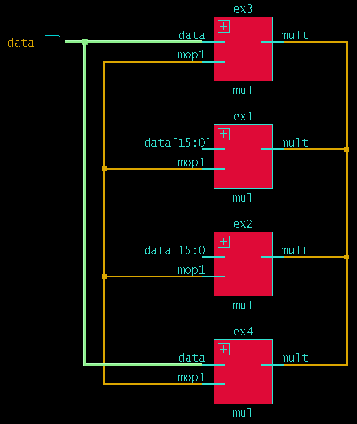

# Examples with Implicit Port Connections

This is a short example to show the difference between the two lines below.

I had made a mistake thinking that .data and .data() were equivalent when in reality they mean very different things in SystemVerilog.  The paper below by Cliff Cummings helped me understand the difference and make this shortened example.

"SystemVerilog Implicit Port Connections - Simulation & Synthesis" by Cliff Cummings

```
multiplier multiplier_ex1 (.mult, .mop1, .data);
multiplier multiplier_ex3 (.mult, .mop1, .data());
```

